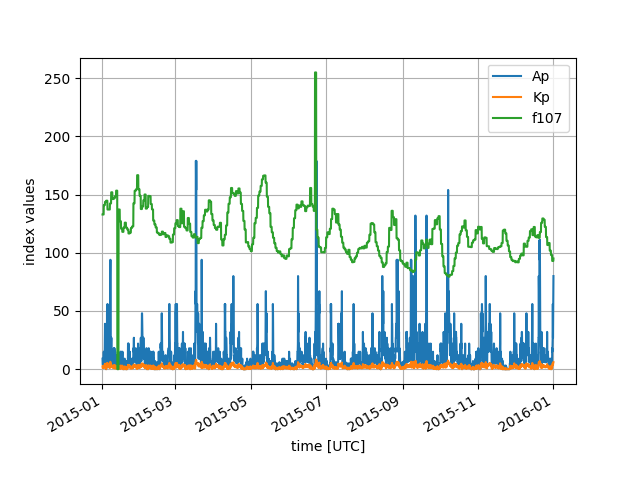

[](https://travis-ci.com/scivision/geomag-indices)
[](https://coveralls.io/github/scivision/geomag-indices?branch=master)
[](https://pypi.python.org/pypi/geomagindices)
[](http://pepy.tech/project/geomagindices)


# Geomagnetic Indices
Geomagnetic indices downloader and parser, returns Ap, F10.7 (unsmoothed and smoothed) and Kp.
Let us know via GitHub Issue if something is missing.

Output datatype is [pandas.DataFrame](http://pandas.pydata.org/pandas-docs/stable/reference/frame.html) (for multiple times)

internally, uses
[pandas.Index.get_loc](https://pandas.pydata.org/pandas-docs/stable/reference/api/pandas.Index.get_loc.html)
to find nearest time to request.

## Examples

use from other programs like
```python
import geomagindices as gi

inds = gi.get_indices(date)
```

where date is Python
[datetime.date, datetime.datetime](https://docs.python.org/3/library/datetime.html), etc.

---

```sh
python PlotIndices.py 2015-01-01 2016-01-01
```




## Notes

We should add readers for the new post-SWPC data sources, from 2018 onward as noted at:
https://www.celestrak.com/SpaceData/SpaceWx-format.php

* [Kp, Ap](ftp://ftp.gfz-potsdam.de/pub/home/obs/kp-ap/wdc/)
* [f10.7](ftp://ftp.geolab.nrcan.gc.ca/data/solar_flux/daily_flux_values/fluxtable.txt)

Let us know via GitHub Issue if you want this new data.